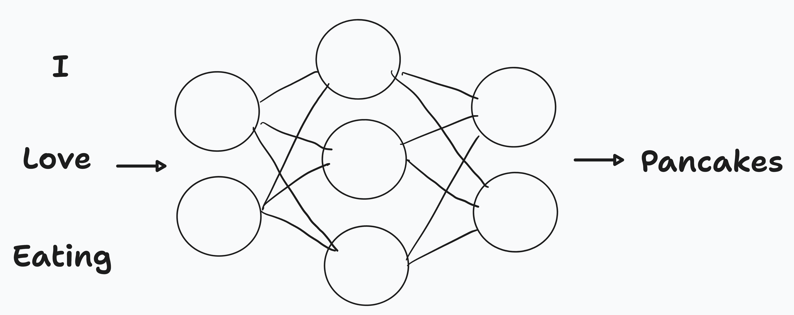
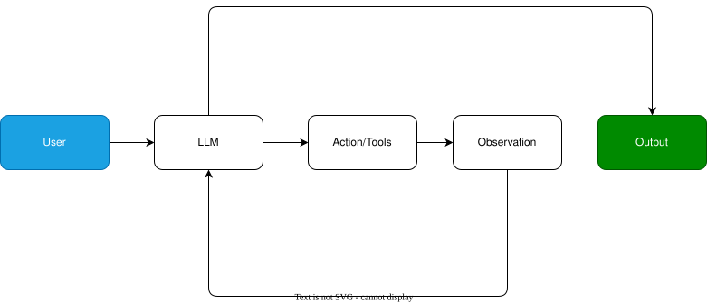
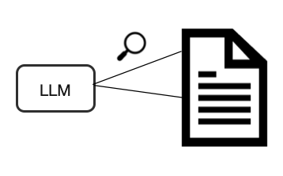
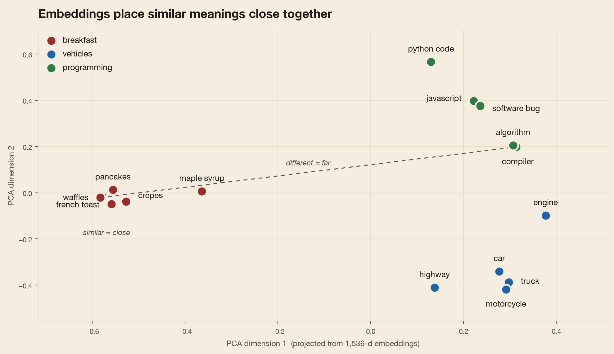
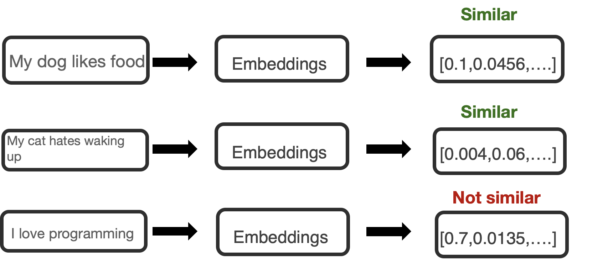

<!-- _class: lead dark -->
<!-- _paginate: false -->

<div class="kicker">O'Reilly Live Training · August 2026</div>

# Getting Started with <em>LangChain</em>

Build AI agents with LangChain 1.0 — from a hand-rolled loop to a deployed app.

Lucas Soares · Automata Learning Lab

---

<div class="kicker">How this works</div>

## Training rhythm

<div class="flow">
<div class="step"><h3>Presentation</h3><p>Concepts, short</p></div>
<div class="arrow">→</div>
<div class="step"><h3>Notebook demo</h3><p>Live code</p></div>
<div class="arrow">→</div>
<div class="step"><h3>Q&A + summary</h3><p>Polls & questions</p></div>
<div class="arrow">→</div>
<div class="step"><h3>Exercise</h3><p>Optional, during Q&A</p></div>
</div>

* Repeat for each part — interrupt with questions anytime

---

<div class="kicker">Agenda</div>

## What we'll cover

1) **What is an agent?** — build one from scratch, then with `create_agent()` · *notebook 00*
2) **LangChain fundamentals** — models, messages, tools, memory, streaming · *notebook 1.0*
3) **Structured outputs** — typed results with Pydantic · *notebook 2.0*
4) **RAG** — embeddings, vector stores, retrieval agents · *notebook 3.0*
5) **Ship it** — `langgraph dev`, a fully local agent, and a public Vercel app · *demos*

---

## Large Language Models predict the next word



---

## What is LangChain?

* **"LangChain is the agent framework; LangGraph is the orchestration runtime"** — [docs.langchain.com](https://docs.langchain.com/oss/python/langchain/overview)
* LangChain **1.x**: the agent is the central abstraction — <em>`create_agent()`</em>
* Built on **LangGraph** underneath — persistence, streaming, and deployment for free
* Legacy patterns (`AgentExecutor`, `prompt | llm | parser` piping) moved out to `langchain-classic` — not the story anymore

---

<!-- _class: lead dark -->
<!-- _paginate: false -->

<div class="kicker">Part 0 · notebook 00</div>

# What is an <em>agent</em>?

Build one by hand first — so the abstraction is a shortcut, not a black box.

---

<!-- _class: dark quote -->

> <span class="mark">"</span>An agent is a model calling tools in a loop until a given task is complete.<span class="mark">"</span>

<div class="by">— <a href="https://docs.langchain.com/oss/python/langchain/agents">the official LangChain docs</a> · "Agent = Model + Harness"</div>

---

## The core components of an agent

<div class="bento">
<div class="cell"><h3>LLM</h3><p>The reasoning engine — decides what to say, or which tool to call.</p></div>
<div class="cell"><h3>Tools</h3><p>Plain Python functions. The LLM asks; <em>your code</em> executes.</p></div>
<div class="cell"><h3>Loop</h3><p>Call model → run requested tools → feed results back → repeat.</p></div>
</div>

* Every agent framework is a packaging of these three pieces

---

## The agent loop



---

<!-- _class: dark -->

<div class="kicker">Step 1 — just an LLM call</div>

```python
from langchain.chat_models import init_chat_model
from langchain.messages import HumanMessage, SystemMessage

model = init_chat_model("openai:gpt-5.6-terra", reasoning_effort="none")

response = model.invoke([
    SystemMessage(content="You tell jokes."),
    HumanMessage(content="Tell me a joke about a bald teacher."),
])
print(response.content)   # an AIMessage — text in, text out
```

No tools, no loop — the model can only *talk*. Let's give it hands.

---

<!-- _class: dark -->

<div class="kicker">Step 2 — tools with @tool</div>

```python
from langchain_core.tools import tool

@tool
def create_folder(folder_name: str) -> str:
    """Create a folder (directory) inside the sandbox workspace."""
    path = os.path.join(SANDBOX_DIR, folder_name)
    os.makedirs(path, exist_ok=True)
    return f"Folder created at: {path}"

tools = [create_folder, create_file, read_file, calculator]
tools_by_name = {t.name: t for t in tools}
```

Type hints + docstring **are** the schema the model sees.

---

<!-- _class: dark -->

<div class="kicker">Step 3 — the model asks, your code executes</div>

```python
model_with_tools = model.bind_tools(tools)

ai_message = model_with_tools.invoke(messages)
ai_message.tool_calls
# [{"name": "create_folder", "args": {"folder_name": "notes"}, "id": "..."}]

from langchain.messages import ToolMessage
messages.append(ai_message)
for call in ai_message.tool_calls:
    result = tools_by_name[call["name"]].invoke(call["args"])
    messages.append(ToolMessage(content=str(result), tool_call_id=call["id"]))
```

The model only *requested* the call — nothing ran until our loop ran it.

---

<!-- _class: dark -->

<div class="kicker">Step 4 — the whole agent, by hand</div>

```python
def run_agent_loop(user_task: str, max_iters: int = 5):
    messages = [SystemMessage(...), HumanMessage(content=user_task)]
    for i in range(max_iters):
        ai_message = model_with_tools.invoke(messages)
        messages.append(ai_message)
        if not ai_message.tool_calls:          # done — no more tool requests
            return ai_message.content
        for call in ai_message.tool_calls:     # execute each requested tool
            result = tools_by_name[call["name"]].invoke(call["args"])
            messages.append(ToolMessage(content=str(result),
                                        tool_call_id=call["id"]))
    return messages[-1].content
```

~15 lines. This **is** an agent.

---

<!-- _class: dark -->

<div class="kicker">Step 5 — the same agent with create_agent()</div>

```python
from langchain.agents import create_agent

agent = create_agent(
    model=model,          # binds the tools for you
    tools=tools,
    system_prompt="You are a desktop file-system assistant.",
)

result = agent.invoke({"messages": "Create a folder called 'trip-notes' ..."})
result["messages"][-1].pretty_print()
```

Same behavior, three lines — now you know exactly what it's hiding.

---

## What `create_agent()` replaced

| From-scratch piece | `create_agent()` |
|---|---|
| `model.bind_tools(tools)` | internal, via `tools=[...]` |
| Building `System`/`Human` messages | `system_prompt=` + `{"messages": ...}` |
| Reading `tool_calls`, dispatching | internal |
| Building `ToolMessage(...)` | internal |
| The loop + safety cap | built into the compiled graph |

---

<!-- _class: lead -->

<div class="kicker">Notebook demo</div>

# `00-langchain-basics-intro.ipynb`

Agents from scratch → `create_agent()`

---

## Q&A · Part 0 recap

* An **agent = LLM + tools + loop** — the LLM requests, your code executes, results feed back
* `bind_tools()` makes the model emit `tool_calls`; `ToolMessage` carries results back
* `create_agent()` **packages that exact loop** — an abstraction you've now built yourself

<div class="cell" style="margin-top:20px"><h3>Optional exercise</h3><p>Add a <code>delete_file</code> tool to the from-scratch loop and have the agent clean up its own sandbox.</p></div>

---

## Poll

```text
Which best describes what create_agent() returns in LangChain 1.0?

  A. A REST API endpoint for the model
  B. A compiled LangGraph graph you invoke with {"messages": [...]}
  C. A fixed script that cannot be modified once generated
  D. A raw string containing the model's response
```

---

<!-- _class: lead dark -->
<!-- _paginate: false -->

<div class="kicker">Part 1 · notebook 1.0</div>

# LangChain <em>fundamentals</em>

Six building blocks you'll use in every app.

---

## The six building blocks

<div class="bento">
<div class="cell"><h3>Agents</h3><p><code>create_agent()</code> — the central API</p></div>
<div class="cell"><h3>Models</h3><p><code>init_chat_model()</code></p></div>
<div class="cell"><h3>Messages</h3><p>system · human · ai · tool</p></div>
<div class="cell"><h3>Tools</h3><p><code>@tool</code> decorator</p></div>
<div class="cell"><h3>Memory</h3><p>checkpointer + thread</p></div>
<div class="cell"><h3>Streaming</h3><p>values · messages · custom</p></div>
</div>

---

## Models — one factory, any provider

| Provider | Model string | Package |
|---|---|---|
| OpenAI | `openai:gpt-5.6-terra` | `langchain-openai` |
| Anthropic | `anthropic:claude-sonnet-4-6` | `langchain-anthropic` |
| Google | `google_genai:gemini-3.1-flash` | `langchain-google-genai` |
| Local (Ollama) | `ollama:gemma3` | `langchain-ollama` |

* Three call styles: **`invoke()`** one response · **`stream()`** token by token · **`batch()`** parallel

---

<!-- _class: dark -->

<div class="kicker">Messages — typed conversation turns</div>

```python
from langchain_core.messages import SystemMessage, HumanMessage

messages = [
    SystemMessage("You are a pirate that answers briefly."),
    HumanMessage("What is machine learning?"),
]
response = model.invoke(messages)      # -> AIMessage

response.usage_metadata               # token accounting
response.content_blocks               # v1: unified content across providers
```

Dict form works too: `{"role": "user", "content": "..."}` — fully interchangeable.

---

## Tools — two hard rules

* **Type hints are mandatory** — they define the argument schema
* **Docstrings are mandatory** — they tell the model *when* to call it
* Complex inputs? Attach a Pydantic model: `@tool(args_schema=WeatherQuery)`
* Runtime context without hardcoding: `context_schema=` + `ToolRuntime` (dependency injection)

---

<!-- _class: dark -->

<div class="kicker">Short-term memory — checkpointer + thread_id</div>

```python
from langgraph.checkpoint.memory import InMemorySaver

agent = create_agent(
    model=model, tools=[search],
    checkpointer=InMemorySaver(),
)

config = {"configurable": {"thread_id": "session-1"}}
agent.invoke({"messages": "Hi! My name is Lucas."}, config)
agent.invoke({"messages": "What's my name?"}, config)   # remembers
# thread_id "session-2" -> a fresh conversation, no Lucas
```

---

## Streaming — three modes

| Mode | You get | Use for |
|---|---|---|
| `"values"` | full state after each step | inspecting agent steps |
| `"messages"` | `(token, metadata)` tuples | chat UX, token by token |
| `"custom"` | your own events via `get_stream_writer()` | tool progress updates |

---

<!-- _class: dark quote -->

> <span class="mark">"</span>Reasoning models need `reasoning_effort="none"` to call function tools.<span class="mark">"</span>

<div class="by">— the course gotcha: whenever an agent has tools, build the model with<br><code>init_chat_model("openai:gpt-5.6-terra", reasoning_effort="none")</code></div>

---

<!-- _class: lead -->

<div class="kicker">Notebook demo</div>

# `1.0-langchain-fundamentals.ipynb`

Models · messages · tools · memory · streaming

---

## Q&A · Part 1 recap

* **`init_chat_model("provider:model")`** — same call shape for OpenAI, Anthropic, Google, Ollama
* **Tools** are functions with type hints + docstrings; schemas are generated for you
* **Memory** = `checkpointer` + `thread_id`; **streaming** = `values` / `messages` / `custom`

<div class="cell" style="margin-top:20px"><h3>Optional exercise</h3><p>Create an agent with <code>create_agent()</code> and a tool that builds a schedule from a <code>task | date</code> table.</p></div>

---

## Poll

```text
Which statement best captures the primary advantage of using a framework
like LangChain for LLM-based applications?

  A. It automatically trains your model without any configuration
  B. It offers unified abstractions (agents, models, tools) that
     streamline development
  C. It focuses solely on deployment, not on application logic
  D. It restricts user inputs to enhance security
```

---

<!-- _class: lead dark -->
<!-- _paginate: false -->

<div class="kicker">Part 2 · notebook 2.0</div>

# Structured <em>outputs</em>

From "nice prose" to data your code can use.

---

## Why structured output?

<div class="two-col">
<div>

### Free text
* "Maria seems like a strong candidate, with solid Python..."
* Can't sort, filter, or store it
* Parsing prose = regex pain

</div>
<div>

### Structured
* `evaluation.fit_score` → `87`
* `evaluation.recommendation` → `"hire"`
* Type-safe: Pydantic validates every field

</div>
</div>

---

<!-- _class: dark -->

<div class="kicker">response_format + Pydantic</div>

```python
from pydantic import BaseModel, Field
from typing import List, Literal

class MovieReview(BaseModel):
    """Structured analysis of a movie review."""
    title: str
    sentiment: Literal["positive", "negative", "mixed"]
    rating: int = Field(ge=1, le=10)
    key_points: List[str]
    recommended: bool

agent = create_agent(model="openai:gpt-5.6-terra", response_format=MovieReview)
result = agent.invoke({"messages": "Analyze this review: ..."})
review = result["structured_response"]     # a validated MovieReview
```

---

## Two strategies under the hood

| | `ProviderStrategy` | `ToolStrategy` |
|---|---|---|
| How | provider's native structured-output API | tool-calling to extract |
| Works with | OpenAI · Anthropic · Gemini | any tool-capable model |
| Speed | fastest | one extra hop |
| Gotcha | — | needs `reasoning_effort="none"` |

* Pass the schema directly (`response_format=MovieReview`) and LangChain **auto-picks**

---

## Real application: resume analyzer

* **Nested models**: `JobFitEvaluation` contains a `CandidateProfile` + a list of `SkillAssessment`
* Constrained fields: `fit_score: int = Field(ge=0, le=100)`, `recommendation: Literal["strong_hire", "hire", "maybe", "no_hire"]`
* **Batch scoring**: evaluate N resumes, then `sorted(evaluations, key=lambda e: e.fit_score)` — <em>only possible with structured output</em>

---

<!-- _class: lead -->

<div class="kicker">Notebook demo</div>

# `2.0-structured-outputs.ipynb`

Typed results, nested models, batch scoring

---

## Q&A · Part 2 recap

* **`response_format=YourModel`** on `create_agent()` → `result["structured_response"]`
* **Pydantic** for production (validation, nesting); TypedDict for quick dicts
* `ProviderStrategy` vs `ToolStrategy` — auto-selection picks for you

<div class="cell" style="margin-top:20px"><h3>Optional exercise</h3><p>Define a Pydantic schema for meeting minutes (attendees, decisions, action items) and extract it from a transcript.</p></div>

---

## Poll

```text
With response_format=MyPydanticModel, where does the typed result appear?

  A. result["messages"][-1].content, as a JSON string to parse
  B. result["structured_response"], as a validated model instance
  C. It's written to a file next to the notebook
  D. In a separate .schema attribute on the agent
```

---

<!-- _class: lead dark -->
<!-- _paginate: false -->

<div class="kicker">Part 3 · notebook 3.0</div>

# Chat over documents — <em>RAG</em>

Retrieval Augmented Generation with LangChain.

---

## Why RAG?



* Connect LLMs to **your** documents — PDFs, HTML, text
* Context windows are finite; your document base isn't
* The workaround: **embeddings** + retrieval of just-the-relevant chunks

---

## Embeddings — meaning as geometry



- Real 1,536-d vectors from `text-embedding-3-small`, projected to 2D — distance ≈ meaning

---

## Embeddings power similarity search



* A **vector store** (Chroma) indexes the vectors so "nearest neighbors" is one query

---

## Indexing pipeline

<div class="flow">
<div class="step"><h3>Load</h3><p>WebBaseLoader</p></div>
<div class="arrow">→</div>
<div class="step"><h3>Split</h3><p>1000 chars, 200 overlap</p></div>
<div class="arrow">→</div>
<div class="step"><h3>Embed</h3><p>text-embedding-3-small</p></div>
<div class="arrow">→</div>
<div class="step"><h3>Store</h3><p>Chroma</p></div>
</div>

```python
splits = RecursiveCharacterTextSplitter(chunk_size=1000, chunk_overlap=200).split_documents(docs)
vector_store = Chroma.from_documents(documents=splits,
    embedding=OpenAIEmbeddings(model="text-embedding-3-small"),
    collection_name="rag-tutorial", persist_directory="./chroma-db")
```

---

<!-- _class: dark -->

<div class="kicker">A RAG agent — retrieval as a tool</div>

```python
@tool(response_format="content_and_artifact")
def retrieve_context(query: str):
    """Retrieve information to help answer a query."""
    docs = vector_store.similarity_search(query, k=2)
    serialized = "\n\n".join(
        f"Source: {d.metadata}\nContent: {d.page_content}" for d in docs)
    return serialized, docs

agent = create_agent(model, [retrieve_context],
    system_prompt="Use the retrieval tool to answer user queries.")
```

The **agent decides** when (and how often) to search.

---

## RAG agents vs RAG chains

| | RAG agent — "Agentic RAG" | RAG chain — "2-Step RAG" |
|---|---|---|
| Search happens | when the LLM decides | always, before the call |
| Multiple searches | yes, with rewritten queries | one |
| Latency / cost | ≥ 2 model calls | 1 model call |
| How | retrieval `@tool` | `@dynamic_prompt` middleware |
| Best for | complex, multi-hop questions | predictable, speed-critical |

* **Middleware** is v1's headline extension point — here it injects context and can **return source documents** for citations ([more built-ins](https://docs.langchain.com/oss/python/langchain/middleware): summarization, human-in-the-loop, PII)

---

<!-- _class: lead -->

<div class="kicker">Notebook demo</div>

# `3.0-rag-with-langchain.ipynb`

Index two engineering blog posts, then chat with them

---

## Q&A · Part 3 recap

* **Embeddings** turn text into vectors where distance ≈ similarity of meaning
* **Indexing**: load → split → embed → store (Chroma + `text-embedding-3-small`)
* **RAG agent** (LLM decides, retrieval `@tool`) vs **RAG chain** (always retrieve, middleware)

<div class="cell" style="margin-top:20px"><h3>Optional exercise</h3><p>Build a RAG agent with <code>create_agent()</code> over a PDF or CSV of your choice.</p></div>

---

## Poll

```text
What is the primary purpose of embeddings when building LLM-powered
document chat systems?

  A. Managing API requests and rate limits
  B. Turning text into numerical vectors for similarity comparison
  C. Automatically generating user interface elements
  D. Serving as a secure authentication method
```

---

<!-- _class: lead dark -->
<!-- _paginate: false -->

<div class="kicker">Part 4 · demos</div>

# From notebook to <em>app</em>

Three ways to ship the same agent.

---

## 1 · `langgraph dev` + Agent Chat UI

* The `demo/` app: RAG over two blog posts + Tavily web search — one `create_agent()` call
* `uv run langgraph dev` → starts the **Agent Server** at `http://localhost:2024`, hot-reloading, **persistence built in**
* Connect [agentchat.vercel.app](https://agentchat.vercel.app) → graph ID `chat_over_docs`
* `LANGSMITH_TRACING=true` → every run traced in LangSmith (tools, tokens, full history)

---

## 2 · A fully local agent — `local_agent.py`

* `init_chat_model("ollama:gemma4")` — **no API key**, same `create_agent()` API
* File tools + `bash`, all **sandboxed**: path-escape guard, command blocklist, 20s timeout
* Tavily search + a running `memory.md` log the agent writes after each task
* One file, `uv run` — inline script dependencies

```python
llm = init_chat_model("ollama:gemma4")
tools = [search, read_file, write_file, edit_file, delete_file, bash]
agent = create_agent(model=llm, tools=tools)
```

---

## 3 · Chat-over-PDFs on Vercel

* Same agent, now a **public web app**: chat pane + PDF viewer that jumps to the cited page
* Serverless can't host Chroma → index **pre-built offline** to JSON; runtime = numpy cosine similarity
* One-file FastAPI app: agent + `/api/chat` + embedded UI · full recipe in `internal-docs-search-agent/DEPLOYMENT_GUIDE.md`
* Torn down between classes — the guide recreates it in minutes

---

<!-- _class: lead -->

<div class="kicker">Live demo</div>

# `langgraph dev` · local agent · Vercel

The same `create_agent()` pattern, three deployment stories

---

## Final Q&A · the whole course on one slide

* **Agent = LLM + tools + loop** — you built it by hand, then let `create_agent()` package it
* **Six building blocks**: agents, models, messages, tools, memory, streaming
* **Structured output** makes agent results programmable; **RAG** grounds them in your documents
* The same agent runs in a notebook, behind `langgraph dev`, fully local on Ollama, or on Vercel

---

<!-- _class: lead dark -->
<!-- _paginate: false -->

<div class="kicker">Thank you</div>

# Thanks for <em>building</em> along

Questions → lucas@automata-learning-lab · course repo has every notebook, demo, and deploy guide

---

<div class="kicker">References</div>

## Keep going

- [LangChain documentation](https://docs.langchain.com/)
- [LangChain agents guide](https://docs.langchain.com/oss/python/langchain/agents)
- [LangGraph](https://langchain-ai.github.io/langgraph/) · [LangSmith](https://smith.langchain.com/)
- [Agent Chat UI](https://github.com/langchain-ai/agent-chat-ui)
- [ReAct paper](https://arxiv.org/abs/2210.03629) · [Toolformer](https://arxiv.org/pdf/2302.04761.pdf)
- [Karpathy on agents](https://www.youtube.com/watch?v=fqVLjtvWgq8)
- Course repo: notebooks `00` → `3.0`, `demo/`, `local_agent.py`, `internal-docs-search-agent/`
